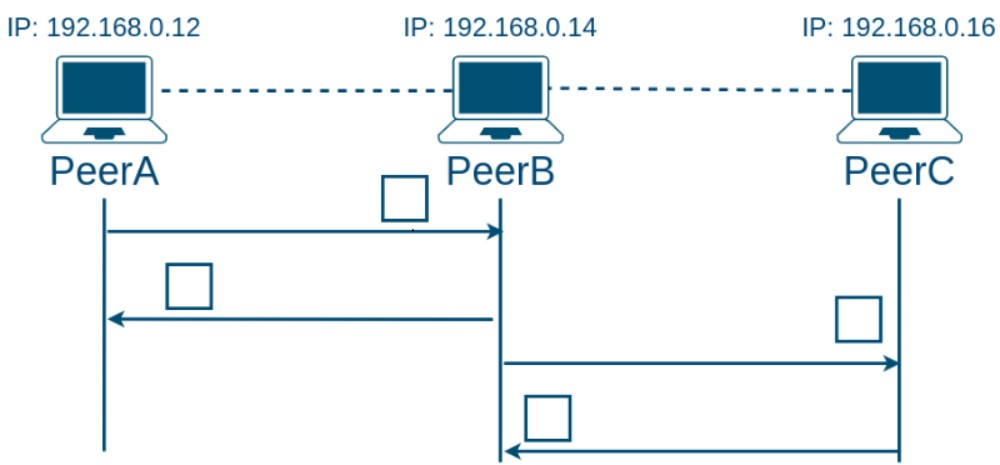

# UDPChat – Mini Laboratorio de Computación en Internet I

## Universidad ICESI - Computación en Internet I G.003 - Docente Nicolas Salazar Echeverry

### Proyecto de chat P2P sobre UDP desarrollado en Java y JavaFX, con arquitectura modular y patrón Singleton para la conexión de red.

---

## 📋 Descripción del Proyecto

Este proyecto implementa un sistema de mensajería punto a punto (P2P) mediante el protocolo UDP. Cada "peer" (A, B o C) puede enviar y recibir mensajes de otros peers según el diagrama de comunicación definido por el profesor.

Los objetivos principales son:

* Practicar el uso de sockets UDP en Java.
* Aplicar el patrón de diseño **Singleton** para gestionar la conexión de red de manera centralizada.
* Desarrollar una interfaz gráfica con **JavaFX** que muestre burbujas de chat animadas y responsivas.
* Manejar la serialización y parseo de mensajes con estrategias intercambiables (texto plano, cifrado, etc.).

---

## 📁 Estructura del Proyecto

```
udpchat/
├── src/
│   └── main/
│       ├── java/
│       │   └── udpchat/
│       │       ├── network/
│       │       │   ├── UDPConnection.java       # Singleton + hilo de recepción UDP
│       │       │   ├── MessageHandler.java      # Interfaz Observer para nuevos mensajes
│       │       │   ├── MessageStrategy.java     # Estrategia de serialización/parsing
│       │       │   ├── PlainTextStrategy.java   # Implementación básica de texto plano
│       │       │   └── SecurityUtils.java       # Utilidades (AES, HMAC, CRC32)
│       │       ├── peer/
│       │       │   ├── PeerInfo.java            # Constantes de IPs y puertos
│       │       │   ├── PeerA.java               # Lógica de Peer A (solo habla con B)
│       │       │   ├── PeerB.java               # Lógica de Peer B (habla con A y C)
│       │       │   └── PeerC.java               # Lógica de Peer C (solo habla con B)
│       │       └── ui/
│       │           ├── Main.java                # Clase de arranque de la aplicación JavaFX
│       │           ├── PeerController.java      # Controlador FXML: lógica de interfaz
│       │           └── Mensaje.java             # Modelo de mensaje (texto, emisor, outgoing)
│       └── resources/
│           └── udpchat/
│               ├── chat.css                    # Estilos CSS para las burbujas de chat
│               ├── diagramaPropuesto.jpg       # Imagen con el diagrama del sistema
│               ├── icono.png                   # Ícono de la aplicación
│               ├── InformeTallerUDPConnection.pdf # Informe del taller
│               └── peer.fxml                   # Diseño de la interfaz (FXML)
├── LICENSE                                     # Licencia del proyecto
└── README.md                                   # Documentación del proyecto

```

---

## 🛠 Tecnologías y Dependencias

* **Java 17+**
* **JavaFX 17**
* **Maven** para gestión de dependencias y ejecución (`javafx-maven-plugin`)
* **Patrón Singleton** para `UDPConnection` (solo una instancia global)
* **Pattern Strategy** para el parseo y preparación de mensajes

---

## 🔍 Descripción de Componentes

### UDPConnection (Singleton)

* Gestiona la creación del socket UDP.
* Inicia un hilo `Hilo-RX-UDP` para recibir mensajes.
* Usa un `ExecutorService` para envíos asíncronos.
* Permite registrar oyentes (`MessageHandler`) para eventos de nuevos mensajes.

### MessageStrategy / PlainTextStrategy

* Define cómo convertir mensajes de texto a bytes y viceversa.
* La implementación por defecto (`PlainTextStrategy`) usa codificación UTF-8.

### SecurityUtils

* Provee métodos de cifrado AES, HMAC SHA-256 y CRC32 para demos o mejoras futuras.

### Peers (A, B, C)


* `PeerInfo`: constantes de IP (`127.0.0.1`) y puertos (`5000`, `5001`, `5002`).
* `PeerA`, `PeerB`, `PeerC`: clases con `main` que configuran la conexión, registran oyentes y envían saludos iniciales.

### Interfaz Gráfica (JavaFX)

* `Main.java`: carga el `peer.fxml`, aplica estilos y muestra la ventana fija.
* `PeerController.java`: controla la UI, maneja selección de peer y envíos.

  * Burbujas de chat con animaciones de entrada (fade + slide).
  * Limita ancho de burbuja al 75% del ancho de la lista.
  * Diferencia colores pastel según emisor (`peer-a`, `peer-b`, `peer-c`).
* `Mensaje.java`: modelo simple con emisor, texto y flag `outgoing`.

---

## 👥 Equipo de Trabajo

* **Martinez Vasquez Luna Catalina** – A00401964 - https://github.com/LunaKtalina
* **Mosquera Daza Renzo Fernando** – A00401681 - https://github.com/RenzoFernando
* **Reyes Riveros Simon** – A00400880 - https://github.com/SIKKING4
